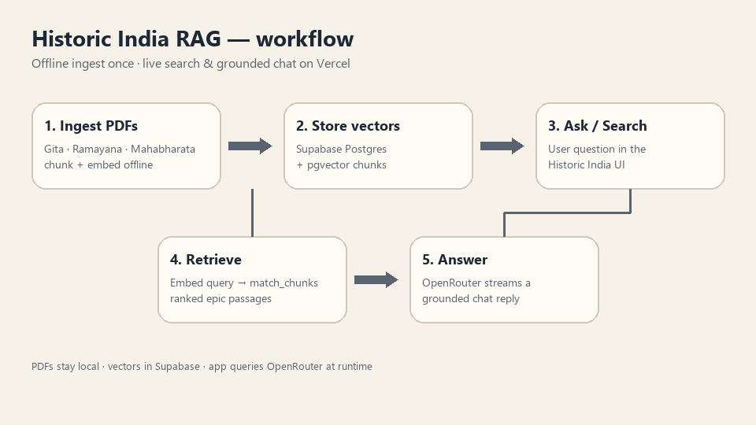
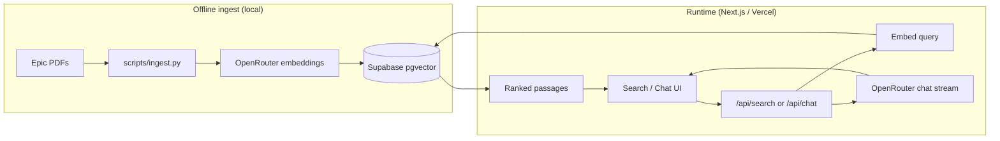
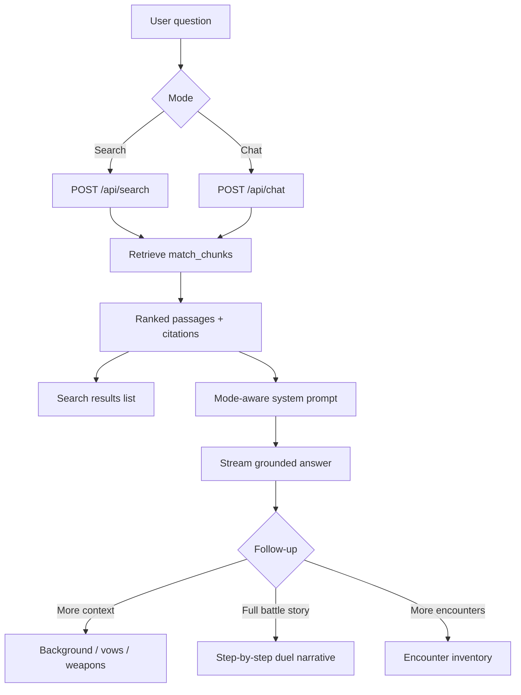

# Historic India RAG

Next.js app for semantic search and chat Q&A over historic Indian texts (Mahabharata, Ramayana, Bhagavad Gita). Embeddings live in Supabase pgvector; generation uses OpenRouter.

## How it works



Offline ingest builds the vector store once. At runtime the app embeds the user question, retrieves ranked passages, and (in chat) streams a grounded answer, then may draw a sanitized animated SVG scene from that context. Follow-ups switch modes for more background, a full battle story, or an encounter inventory.

### Architecture



### Search vs chat



## Prerequisites

- Node.js 20+
- Python 3.11+ (ingest only)
- A [Supabase](https://supabase.com) project (free tier is fine)
- An [OpenRouter](https://openrouter.ai) API key
- The three source PDFs at the repo root (gitignored; see [Corpus](#corpus))

This repo is safe to push publicly: `.env.local`, PDFs, `node_modules/`, and build artifacts are gitignored. Never commit secrets.

## End-to-end setup

### 1. Supabase

1. Create a Supabase project.
2. Open **SQL Editor** and run the full contents of [`supabase/migrations/001_chunks.sql`](supabase/migrations/001_chunks.sql). This enables the `vector` extension, creates the `chunks` table, adds indexes, and defines the `match_chunks` RPC.

No extra dashboard toggles are required beyond running that script.

### 2. Environment variables

Copy the example env file and fill in your values:

```bash
cp .env.example .env.local
```

| Variable | Used by | Notes |
|----------|---------|-------|
| `OPENROUTER_API_KEY` | ingest + app | Required |
| `OPENROUTER_CHAT_MODEL` | app | Optional; defaults to `openai/gpt-4o-mini` |
| `OPENROUTER_EMBEDDING_MODEL` | ingest + app | Optional; defaults to `openai/text-embedding-3-small` |
| `OPENROUTER_SCENE_MODEL` | app (chat scenes) | Optional; defaults to `OPENROUTER_CHAT_MODEL` for post-answer SVG scenes |
| `SUPABASE_URL` | ingest + app | From Supabase project settings |
| `SUPABASE_SERVICE_ROLE_KEY` | ingest + app | Service role key (server-side only) |

**Security:** Never commit `.env.local` or paste API keys into chat or issues. If a key is exposed, rotate it immediately in OpenRouter and Supabase.

### 3. Run the app locally

```bash
npm install
npm run dev
```

Open [http://localhost:3000](http://localhost:3000). Search and chat will not return results until you ingest the corpus (step 4).

### 4. Ingest the PDF corpus

Install Python dependencies and run the offline ingest script on your machine:

```bash
pip install -r scripts/requirements.txt
python scripts/ingest.py --source all
```

The script reads PDFs from the repo root, chunks text, embeds via OpenRouter, and inserts rows into Supabase. Use `--source gita`, `--source ramayana`, or `--source mahabharata` for partial re-runs. Add `--dry-run` to extract and count chunks without API calls.

See [`scripts/README.md`](scripts/README.md) for source PDF filenames and more ingest options.

### 5. Deploy to Vercel

1. Import the repo into [Vercel](https://vercel.com).
2. Set the same environment variables from step 2 in the Vercel project settings.
3. Deploy.

PDFs are **not** required on Vercel. Ingest runs locally once; the deployed app only queries the Supabase database at runtime.

Live demo: [https://historic-rag.vercel.app](https://historic-rag.vercel.app)

## Corpus

Place these gitignored PDFs at the repo root before ingesting:

| File | `source` id |
|------|-------------|
| `The Bhagavad Gita.pdf` | `gita` |
| `valmiki_ramayanam.pdf` | `ramayana` |
| `Menon_Ramesh-The-Complete-Mahabharata_-Volume-1-12.pdf` | `mahabharata` |

## API routes

- `POST /api/search` — embed query, return ranked passages
- `POST /api/chat` — retrieve context, stream a grounded answer (default, more-context, battle-story, or encounters mode), then optionally attach a sanitized animated SVG scene

These public API routes call OpenRouter and spend credits per request.

## Acceptance checklist

After completing setup and ingest, verify:

- [ ] **Search** — A Gita-related query (e.g. "What does Krishna say about duty?") returns relevant passages with source and page badges.
- [ ] **Chat** — Chat mode streams an answer grounded in retrieved context; irrelevant queries are refused when context is empty.
- [ ] **No secrets in git** — `.env.local` is gitignored; no API keys appear in tracked files or commit history.
- [ ] **Build passes** — `npm run build` completes without errors.

## Scripts

| Command | Description |
|---------|-------------|
| `npm run dev` | Start Next.js dev server |
| `npm run build` | Production build |
| `npm run start` | Serve production build |
| `npm run lint` | Run ESLint |
| `npm test` | Run TypeScript unit tests |
| `python scripts/make_workflow_gif.py` | Regenerate `docs/workflow.gif` |
